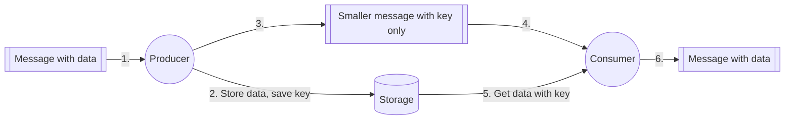

The claim-check pattern is used to reduce the cost and size of large messages by first storing the data in an external storage location and then sending a reference to the data/event to the consumer.

1. Send message
2. Store message in data store
3. Enqueue the message's reference (i.e. key)
4. Read the message's reference
5. Retrieve the message
6. Process the message

## Claim Check Pattern Advantages

- Reduces cost of data transfer via messaging/streams. This is because storage is usually cheaper than messaging/streaming resources (memory).
- Helps protect the message bus and client from being overwhelmed or slowed down by large messages.
- Allows you to asynchronously process data which can help with scalability/performance.

## Claim Check Pattern Disadvantages

- If the external service used to store the payload fails, then the message will not be delivered.
- Requires additional storage space and adds additional time to store/retrieve data.

## Claim Check Pattern Examples

- Kafka client writes payload to S3/Azure Blob Storage/GCS. Then it sends a notification message. The consumer receives the message and accesses the payload from S3/Azure Blob Storage/GCS.
- In Airflow, you sometimes need to pass data between tasks. You can do this using [XComs](https://airflow.apache.org/docs/apache-airflow/stable/core-concepts/xcoms.html) but there is a limit to the size of the message you can send. For passing large messages via XComs you can use the claim check pattern.

Sources:

- https://learn.microsoft.com/en-us/azure/architecture/patterns/claim-check
- https://www.enterpriseintegrationpatterns.com/patterns/messaging/StoreInLibrary.html
- https://serverlessland.com/event-driven-architecture/visuals/claim-check-pattern
- https://aws.plainenglish.io/an-introduction-to-claim-check-pattern-and-its-uses-b018649a380d

%% wiki footer: Please don't edit anything below this line %%

## This note in GitHub

[Edit In GitHub](https://github.dev/data-engineering-community/data-engineering-wiki/blob/main/Concepts/Claim%20Check%20Pattern.md "git-hub-edit-note") | [Copy this note](https://raw.githubusercontent.com/data-engineering-community/data-engineering-wiki/main/Concepts/Claim%20Check%20Pattern.md "git-hub-copy-note")

Was this page helpful?
[👍](https://tally.so/r/mOaxjk?rating=Yes&url=https://dataengineering.wiki/Concepts/Claim%20Check%20Pattern) or [👎](https://tally.so/r/mOaxjk?rating=No&url=https://dataengineering.wiki/Concepts/Claim%20Check%20Pattern)
