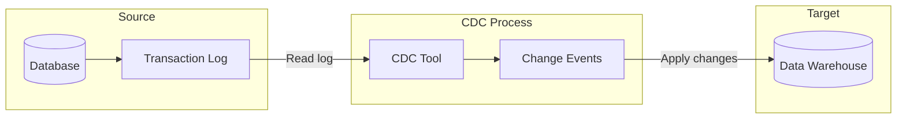

---
Aliases:
  - CDC
  - log-based CDC
  - Concepts/Change Data Capture
Tags:
  - evergreen
publish: true
---

Change data capture (CDC) is a specialized incremental ingestion technique that captures changes from database transaction logs using CDC software. This means tracking when records are inserted, updated, and deleted along with the data itself and optionally events like schema changes. It is a widely used technique because of it's efficiency and minimal impact on source systems. ^overview-cdc

^overview-cdc-diagram

## Change Data Capture Advantages
- Real-time or near real-time data replication
- Minimal impact on source systems
- Captures all types of changes (INSERT, UPDATE, DELETE) and often schema changes as well.

## Change Data Capture Disadvantages
- More complex to set up than [[Full Load|full loads]] or [[Delta Load|delta loads]]
- Usually requires higher permissions to access the database transaction log.

## When to use change data capture
Change data capture is typically used to replicate data that is overwritten to another database. For example, replicating data from an operational database to a data warehouse. While the operational database may not need to store historical changes, it might be useful for analysis.

A few situations where you might use change data capture:

- Replicate changes into a [[Data Warehouse|data warehouse]] or [[Data Lake|data lake]]
- Replicate changes into [[Apache Kafka|Kafka]] (or other streaming tool) in a microservices architecture
- Upgrade a database to a higher version with minimal downtime
- Migrate data from database X to database Y with minimal downtime

## Popular Change Data Capture Tools

- [[Debezium]]
- Confluent
- [[Amazon DMS]]
- Qlik
- Striim
- Matillion Data Loader

%% wiki footer: Please don't edit anything below this line %%

## This note in GitHub

[Edit In GitHub](https://github.dev/data-engineering-community/data-engineering-wiki/blob/main/Concepts/Data%20Ingestion/Change%20Data%20Capture.md "git-hub-edit-note") | [Copy this note](https://raw.githubusercontent.com/data-engineering-community/data-engineering-wiki/main/Concepts/Data%20Ingestion/Change%20Data%20Capture.md "git-hub-copy-note")

Was this page helpful?
[👍](https://tally.so/r/mOaxjk?rating=Yes&url=https://dataengineering.wiki/Concepts/Data%20Ingestion/Change%20Data%20Capture) or [👎](https://tally.so/r/mOaxjk?rating=No&url=https://dataengineering.wiki/Concepts/Data%20Ingestion/Change%20Data%20Capture)
