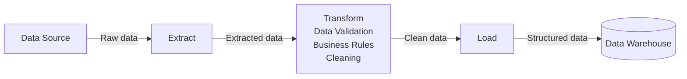
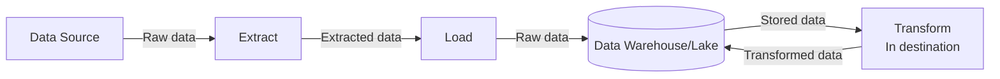
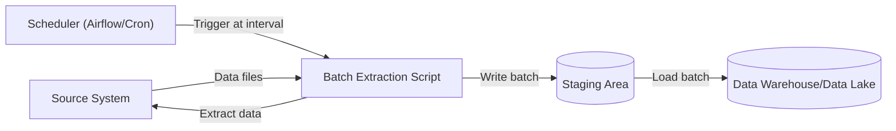
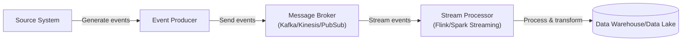
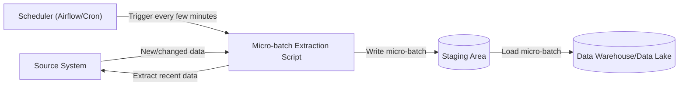
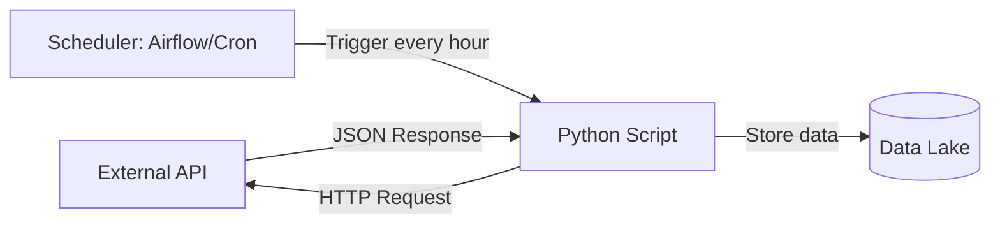
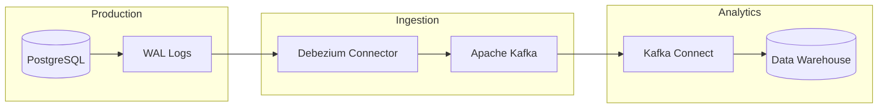
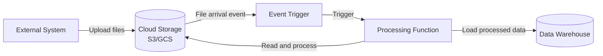

---
Aliases:
  - Concepts/Data Ingestion
Tags:
  - evergreen
publish: true
---

Data ingestion is the process of extracting and importing data from various sources into a destination system where it can be stored, transformed, and analyzed. It commonly involves moving data from operational systems, external sources, or real-time streams into data storage systems like data warehouses and data lakes.

Data ingestion can be categorized into two main approaches: [[Batch Data Processing|batch ingestion]] (processing data in scheduled intervals) and [[Stream Data Processing|real-time/streaming ingestion]] (processing data continuously as it arrives).

## Data Ingestion Components

Data ingestion consists of a few key components that work together to reliably move data from sources to destinations:

### 1. Data Sources

Common data sources include:

- **Databases**: Operational databases (PostgreSQL, MySQL, SQL Server)
- **Applications**: SaaS platforms, CRM systems (Hubspot, Salesforce), ERP systems
- **Files**: CSV, JSON, XML, Parquet files from SFTP/FTP servers or cloud storage
- **APIs**: REST APIs, GraphQL endpoints, webhooks
- **Message Queues**: Kafka, RabbitMQ, Amazon SQS
- **Streaming Sources**: IoT devices, clickstreams, social media feeds
- **Cloud Services**: AWS S3, Google Cloud Storage, Azure Blob Storage

### 2. Ingestion Patterns

#### Extract, Transform, Load (ETL)

ETL is a traditional ingestion pattern where data is extracted from a source, transformed (during the ingestion process), and then loaded into the destination.

#### Extract, Load, Transform (ELT)

ELT is the modern ingestion pattern where raw data is extracted and loaded directly into the destination, then transformed within the destination system. ELT is the more popular pattern because storage is cheap and keeping the raw data allows for more flexibility in future data use cases.

#### [[Batch Data Processing|Batch Ingestion]]

Data is collected and processed in discrete chunks at scheduled intervals.

Characteristics:

- Higher latency (minutes to hours)
- More efficient for large volumes
- Easiest to implement and debug
- Lower infrastructure costs

#### [[Stream Data Processing|Streaming Ingestion]]

Data is processed continuously in real-time as it arrives.

Characteristics:

- Low latency (seconds to milliseconds)
- More complex to implement
- Higher infrastructure costs
- Enables real-time analytics

#### Micro-batch Ingestion

A hybrid approach that processes small batches of data at frequent intervals.

Characteristics:

- **Near** real-time processing (typically 5-15 minutes)
- Balances latency and efficiency
- Easier than true streaming
- Good for most use cases

### 3. Data Ingestion Strategies

#### [[Full Load|Full Load]]

![[Full Load#^overview-full-load]]
![[Full Load#^overview-full-load-diagram]]

#### [[Delta Load|Incremental Load]]

![[Delta Load#^overview-delta-load]]
![[Delta Load#^overview-delta-load-diagram]]

#### [[Change Data Capture|Change Data Capture (CDC)]]

![[Change Data Capture#^overview-cdc]]
![[Change Data Capture#^overview-cdc-diagram]]

## Data Ingestion Examples

Common examples of data ingestion patterns.

### API Data Ingestion Example

Ingesting data from a REST API on a scheduled basis:

### Database Replication Example

Real-time replication from an operational database to an analytics database:

### File-Based Ingestion Example

Processing files dropped into cloud storage:

%% wiki footer: Please don't edit anything below this line %%

## This note in GitHub

[Edit In GitHub](https://github.dev/data-engineering-community/data-engineering-wiki/blob/main/Concepts/Data%20Ingestion/Data%20Ingestion.md "git-hub-edit-note") | [Copy this note](https://raw.githubusercontent.com/data-engineering-community/data-engineering-wiki/main/Concepts/Data%20Ingestion/Data%20Ingestion.md "git-hub-copy-note")

Was this page helpful?
[👍](https://tally.so/r/mOaxjk?rating=Yes&url=https://dataengineering.wiki/Concepts/Data%20Ingestion/Data%20Ingestion) or [👎](https://tally.so/r/mOaxjk?rating=No&url=https://dataengineering.wiki/Concepts/Data%20Ingestion/Data%20Ingestion)
