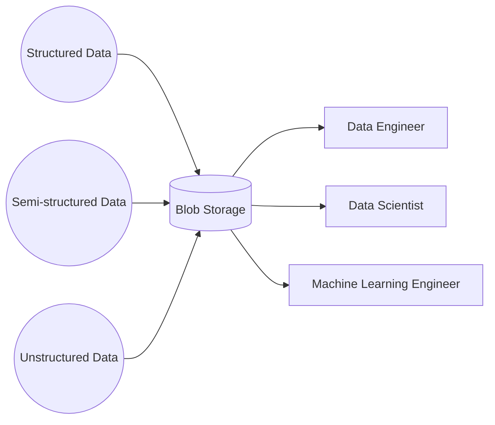

A data lake is a flexible storage pattern that is typically used for storing massive amounts of raw data in its native format.[^1] Data lakes are flexible in that they can store practically any type of data from structured (tabular data), semi-structured (JSON, XML), and unstructured data (videos, images, audio). Data lakes utilize blob storage which is a cheap and abundant and a compute engine of the user's choice.

## Data Lake Advantages

- Cheaply store large amounts of data.
- Flexibly store any type of data (futureproof).
- Allows for compute optimization by mixing and matching compute options for different workloads.
- All data is stored in one place where all stakeholders can work.

## Data Lake Disadvantages

- Data governance is more challenging and relies on robust cataloging and metadata to make the data useful. Cloud providers often offer additional services to address these issues.
- Because storage is cheap, there's a tendency to store more data regardless of it's business value.

## Data Lake Reference Architectures

- AWS: [Deploy and manage a serverless data lake on the AWS Cloud by using infrastructure as code](https://docs.aws.amazon.com/prescriptive-guidance/latest/patterns/deploy-and-manage-a-serverless-data-lake-on-the-aws-cloud-by-using-infrastructure-as-code.html?did=pg_card&trk=pg_card)
- Azure: [Introduction to Azure Data Lake Storage Gen2](https://learn.microsoft.com/en-us/training/modules/introduction-to-azure-data-lake-storage/)
- GCP: [Data lakes in cloud with Kafka and Confluent](https://cloud.google.com/blog/products/data-analytics/data-lakes-in-cloud-with-kafka-and-confluent)

[^1]: [AWS, What is a data lake?](https://aws.amazon.com/big-data/datalakes-and-analytics/what-is-a-data-lake/)

%% wiki footer: Please don't edit anything below this line %%

## This note in GitHub

[Edit In GitHub](https://github.dev/data-engineering-community/data-engineering-wiki/blob/main/Concepts/Data%20Lake.md "git-hub-edit-note") | [Copy this note](https://raw.githubusercontent.com/data-engineering-community/data-engineering-wiki/main/Concepts/Data%20Lake.md "git-hub-copy-note")

Was this page helpful?
[👍](https://tally.so/r/mOaxjk?rating=Yes&url=https://dataengineering.wiki/Concepts/Data%20Lake) or [👎](https://tally.so/r/mOaxjk?rating=No&url=https://dataengineering.wiki/Concepts/Data%20Lake)
