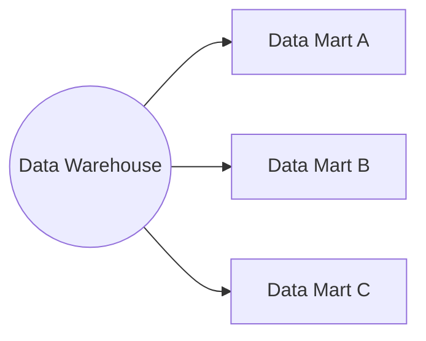

Data mart is a subject-specific database which acts as a partitioned segment of an enterprise data warehouse. The domain of data mart aligns with particular business unit - for instance there would be separate data marts created for finance, marketing, or supply chain departments within company.

## Data Mart Advantages

- in general - better performance due to querying only a subset of data rather than a whole data warehouse, should also require less resources and maintenance than a monolith data warehouse.
- domain focus means data marts should be more flexible and grant bigger user empowerment and encouragement.
## Data Mart Disadvantages

- data quality risk - the risk of arising discrepancies between a data mart and the original data warehouse.
- implementation challenges - poor design may lead to extensive complexity and inconsistencies over time.
## Data Mart Learning Resources
[What is a Data Mart? - Data Mart Explained - AWS (amazon.com)](https://aws.amazon.com/what-is/data-mart/)

%% wiki footer: Please don't edit anything below this line %%
## This note in GitHub

[Edit In GitHub](https://github.dev/data-engineering-community/data-engineering-wiki/blob/main/Concepts/{{title}}.md "git-hub-edit-note") | [Copy this note](https://raw.githubusercontent.com/data-engineering-community/data-engineering-wiki/main/Concepts/{{title}}.md "git-hub-copy-note")

Was this page helpful?
[👍](https://tally.so/r/mOaxjk?rating=Yes&url=https://dataengineering.wiki/Concepts/{{title}}) or [👎](https://tally.so/r/mOaxjk?rating=No&url=https://dataengineering.wiki/Concepts/{{title}})
