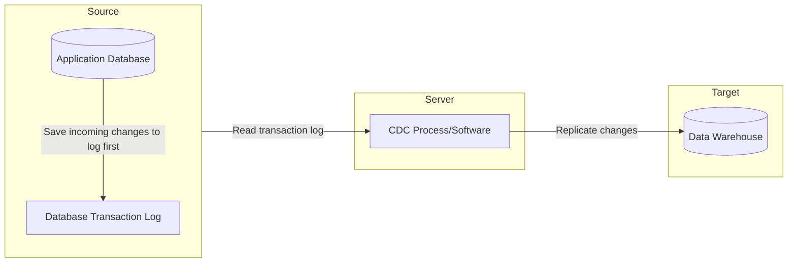
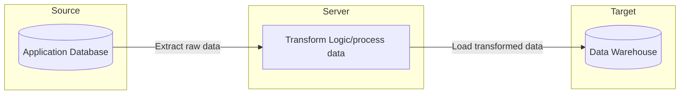
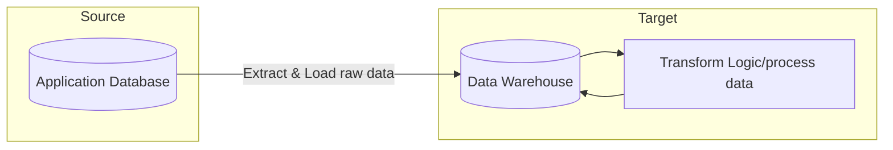

---
aliases:
  - data pipeline
  - ETL
  - ELT
  - ETL Pipeline
tags:
  - incubating
  - concepts/core
publish: true
---

A Data Pipeline is a term used to describe a workflow consisting of one or more tasks that ingest, move, and transform raw data from one or more sources to a destination. Usually, the data at the destination is then used for analysis, machine learning, or other business functions. You can generally separate data pipelines into 2 categories: [[Batch Data Processing|batch processing]] (most common) and [[Stream Data Processing|real-time processing]] pipelines.

![[data_pipeline_patterns.png|800]]
*"Data Pipeline Patterns" by Informatica.com*

## Data Pipeline Architecture

A data pipeline's architecture is made up of 4 main parts: a data source, business logic, a destination, and a scheduler (for batch). It can be as simple as a script running on your computer and automated with Cron or Windows task scheduler. A more complex example might be streaming event data, processing it, then powering dashboards or using it to train machine learning models.

The architecture you choose can vary wildly and there is no one size fits all. However, once you learn the basics of building data pipelines, you'll be able to better understand the tradeoffs between architecture decisions.

### Data Sources

Common data sources are application databases, APIs, or files from an SFTP server. If you are looking for data sources to practice with or analyze, many governments publish their datasets publicly and you can find them by searching "[open data portal](http://googleitfor.me/?q=open+data+portal)."

### Business Logic

Business logic is a general term that encompasses the type of transformations that need to be applied to the data inside the data pipeline. It usually involves cleaning, filtering, and applying logic to the data that is specific to the business.

### Data Destination or Data Target

Typically, the target where you send your data is another database. Common data targets are databases or data storage areas that are made for analytics. For example, a [[Data Warehouse|data warehouse]] or [[Data Lake|data lake]].

### Scheduler or Orchestration Tool

For simple pipelines, Cron is one of the most commonly used tools to schedule a pipeline to run. You typically install it onto a server where you want your script to run and then use [cron syntax](https://crontab.guru/) to tell it when to run.

For more advanced data pipelines where there are multiple steps that depend on each other, an advanced scheduler called a workflow orchestrator is more appropriate. Popular workflow orchestrations tools are: [[Apache Airflow|Airflow]], Prefect, and Dagster.

## Data Pipeline Examples

If a business sold software as a service, a Data Engineer might create a data pipeline that runs on a daily basis which takes some of the data generated by the software application, combine it with some data the marketing department has and send the data to a dashboard. The dashboard could then be used to better understand how customers are using the software.

### Change Data Capture (CDC) Pipeline Example

This is a very commonly created type of data pipeline. You can use a [[Change Data Capture|CDC]] pipeline to replicate changes (inserted, updated, and deleted data) from a source database (typically a db backing an application) and into a destination for analytics such as a data warehouse or data lake.

- [CDC Pipeline example by Confluent](https://github.com/confluentinc/demo-realtime-data-warehousing)
- [CDC Pipeline example using Debezium and Kafka](https://github.com/limadelrey/kafka-connect-cdc-medium)
- [CDC Pipeline example using AWS DMS](https://github.com/aws-samples/aws-dms-cdc-data-pipeline)

### ETL Pipeline Example

ETL is an acronym for extract, transform, and load. Data engineers often use the terms ETL pipeline and data pipeline interchangeably. It is also synonymous with [[Batch Data Processing|batch processing]]. An ETL pipeline generally works by extracting data from a source using custom code or a replication tool, transforming the data using custom code or a transformation tool, and then loading the transformed data to your destination. This pattern was necessary when storage costs were higher but storage has become very cheap over the past decade and is no longer a limitation in most cases. One of the downsides of transforming raw data before loading it to a destination is that you lose the flexibility to re-compute something because the raw data at that point in time is not saved.

- [ETL Pipeline example using Python, Docker, and Airflow](https://github.com/sidharth1805/Spotify_etl)
- [ETL Pipeline example using Airflow, Python/Pandas, and S3](https://github.com/andrem8/surf_dash)

### ELT Pipeline Example

A similar concept to the previous ETL pipeline example except you load the raw data straight from the source into the destination and then transform the raw data in the destination itself. There are a few reasons why this pattern has become more mainstream. Storage cost has become cheap, enabling the ability to store raw data economically. By always having a copy of the raw data in your destination, you can change the way you transform it and perform business logic. In ETL, since the data is transformed before it's loaded to the destination, if you need to change the way you calculate something you can't because the raw data may no longer be available.

- [ELT Pipeline example with Spark, S3, and Airflow](https://github.com/lucaspfigueiredo/elt-pipeline)
- [ELT Pipeline example using dbt, Terraform, and Metabase](https://github.com/ris-tlp/audiophile-e2e-pipeline)

%% wiki footer: Please don't edit anything below this line %%

## This note in GitHub

[Edit In GitHub](https://github.dev/data-engineering-community/data-engineering-wiki/blob/main/Concepts/Data%20Pipeline.md "git-hub-edit-note") | [Copy this note](https://raw.githubusercontent.com/data-engineering-community/data-engineering-wiki/main/Concepts/Data%20Pipeline.md "git-hub-copy-note")

Was this page helpful?
[👍](https://tally.so/r/mOaxjk?rating=Yes&url=https://dataengineering.wiki/Concepts/Data%20Pipeline) or [👎](https://tally.so/r/mOaxjk?rating=No&url=https://dataengineering.wiki/Concepts/Data%20Pipeline)
