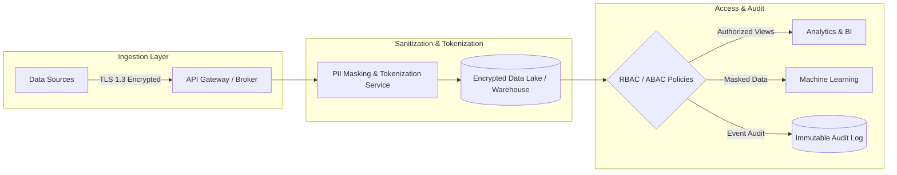

---
Aliases:
  - Concepts/Data Security, Ethics, and Compliance
  - Data Security, Ethics, and Compliance
tags:
  - seedling
publish: true
---

**Data Security, Ethics, and Compliance** encompasses the foundational principles, architectural controls, and governance policies required to safeguard data assets, ensure legal compliance, and promote the responsible, ethical use of data throughout its lifecycle.

In modern data engineering, these three pillars operate together to establish trust, protect user privacy, and prevent regulatory and security failures across storage, pipelines, and analytical interfaces.

## Core Pillars

### 1. Data Security

Data security focuses on protecting digital data from unauthorized access, corruption, exfiltration, or modification throughout its lifecycle:

- **Encryption at Rest:** Ensuring data stored in databases, object storage (S3, GCS, Azure Blob), and backups is encrypted using industry standards such as AES-256 or customer-managed encryption keys (CMEK).
- **Encryption in Transit:** Enforcing modern cryptographic protocols (TLS 1.3, mTLS) for all data moving across external networks, microservices, and cluster nodes.
- **Access Control & Authorization:** Implementing the principle of least privilege using Role-Based Access Control (RBAC), Attribute-Based Access Control (ABAC), and column/row-level security in data warehouses and query engines.
- **Data Protection & De-identification:** Applying data masking, hashing, tokenization, and pseudonymization to protect sensitive fields (PII, financial records) before exposure to analytical consumers.

### 2. [[Data Ethics]]

Data ethics evaluates the moral implications of data collection, processing, algorithmic automation, and analytical decision-making:

- **Data Minimization:** Collecting and retaining only data that is strictly necessary for legitimate business objectives.
- **Fairness & Bias Mitigation:** Ensuring algorithmic models and analytical transformations do not amplify systemic bias or discrimination against demographic groups.
- **Transparency & Consent:** Providing clear insight into how data is collected, stored, and leveraged, while honoring explicit user preferences and opt-outs.
- **Responsible AI:** Establishing accountability frameworks for autonomous agents, automated pipelines, and machine learning models operating on enterprise data.

### 3. Compliance & Governance

Compliance ensures that data systems and practices conform to relevant legal, regulatory, and industry mandates:

- **Privacy Regulations:** Compliance with privacy frameworks including **GDPR** (General Data Protection Regulation), **CCPA/CPRA** (California Consumer Privacy Act), and **LGPD**. Key engineering requirements include honoring data subject access requests (DSAR) and "Right to be Forgotten" (cryptographic erasure or pipeline tombstone deletes).
- **Industry Standards:** Adherence to vertical-specific regulations such as **HIPAA** (healthcare Protected Health Information), **PCI-DSS** (payment card transactions), and **SOC 2 Type II** (operational security and availability trust principles).
- **Data Lineage & Auditability:** Maintaining immutable audit logs of data queries, modifications, and pipeline lineage to enable forensic review and regulatory reporting.

## Security and Compliance Architecture Pattern

The following diagram illustrates how security and compliance controls are applied across modern ingestion and analytical processing stages:

%% wiki footer: Please don't edit anything below this line %%

## This note in GitHub

[Edit In GitHub](https://github.dev/data-engineering-community/data-engineering-wiki/blob/main/Concepts/Data%20Security%2C%20Ethics%2C%20and%20Compliance/Data%20Security%2C%20Ethics%2C%20and%20Compliance.md "git-hub-edit-note") | [Copy this note](https://raw.githubusercontent.com/data-engineering-community/data-engineering-wiki/main/Concepts/Data%20Security%2C%20Ethics%2C%20and%20Compliance/Data%20Security%2C%20Ethics%2C%20and%20Compliance.md "git-hub-copy-note")

Was this page helpful?
[👍](https://tally.so/r/mOaxjk?rating=Yes&url=https://dataengineering.wiki/Concepts/Data%20Security%2C%20Ethics%2C%20and%20Compliance/Data%20Security%2C%20Ethics%2C%20and%20Compliance) or [👎](https://tally.so/r/mOaxjk?rating=No&url=https://dataengineering.wiki/Concepts/Data%20Security%2C%20Ethics%2C%20and%20Compliance/Data%20Security%2C%20Ethics%2C%20and%20Compliance)
