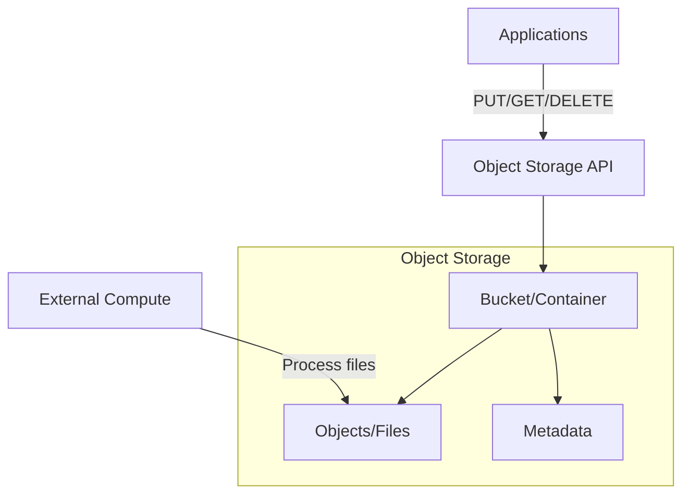

This page contains an overview of the technologies and systems used to store and retrieve data in various formats and structures. Modern data storage can be fundamentally divided into two categories: **Databases** (managed storage with built-in compute) and **Object Storage** (raw storage that requires external compute).

## 1. Databases (Storage + Compute)

[[Database|Databases]] provide both storage and built-in compute capabilities with structured query interfaces.

### [[Relational Database]]

A relational database is a traditional structured storage using tables, rows, and columns with ACID properties.

### Non-Relational (NoSQL) Databases

NoSQL databases store data in flexible formats such as documents, key-value pairs, graphs, or columns, enabling scalability and schema-less design for diverse data types.

![[Non-relational Database#Types of Non-relational Databases]]

## 2. [[Object/Blob Storage]]

Object storage provides raw data persistence without built-in compute - requiring external processing engines.

See the **data stores** category for examples and popular tools.

%% wiki footer: Please don't edit anything below this line %%

## This note in GitHub

[Edit In GitHub](https://github.dev/data-engineering-community/data-engineering-wiki/blob/main/Concepts/Data%20Storage/Data%20Storage.md "git-hub-edit-note") | [Copy this note](https://raw.githubusercontent.com/data-engineering-community/data-engineering-wiki/main/Concepts/Data%20Storage/Data%20Storage.md "git-hub-copy-note")

Was this page helpful?
[👍](https://tally.so/r/mOaxjk?rating=Yes&url=https://dataengineering.wiki/Concepts/Data%20Storage/Data%20Storage) or [👎](https://tally.so/r/mOaxjk?rating=No&url=https://dataengineering.wiki/Concepts/Data%20Storage/Data%20Storage)
