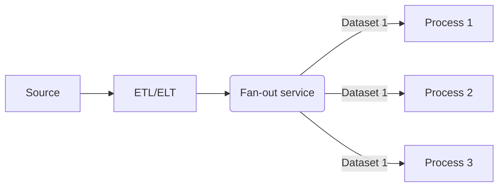

Fan-out is a pattern where a message from a source is spread or copied to one or more destinations. In data engineering, fan-out is commonly used to send data from a microservice (publisher) to multiple subscribers. The fan-out service normally doesn't save the message once it has been sent, so a message queue is also common to see between the fan-out service and the subscriber for catch-up/re-try scenarios.

From the data processing aspect, think about a process have created a dataset, and that dataset is required by many other processes to generate new datasets.

## Fan-out Advantages

- Send data from one source to many destinations

## Fan-out Disadvantages

- Usually limited re-try capabilities if a subscriber is unavailable for an extended period

%% wiki footer: Please don't edit anything below this line %%

## This note in GitHub

[Edit In GitHub](https://github.dev/data-engineering-community/data-engineering-wiki/blob/main/Concepts/Fan-out.md "git-hub-edit-note") | [Copy this note](https://raw.githubusercontent.com/data-engineering-community/data-engineering-wiki/main/Concepts/Fan-out.md "git-hub-copy-note")

Was this page helpful?
[ğŸ‘](https://tally.so/r/mOaxjk?rating=Yes&url=https://dataengineering.wiki/Concepts/Fan-out) or [ğŸ‘](https://tally.so/r/mOaxjk?rating=No&url=https://dataengineering.wiki/Concepts/Fan-out)
