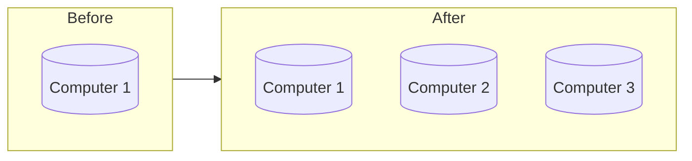

A horizontally scalable system is one that can increase capacity by adding more computers to the system.

## Horizontal Scaling Advantages

- Allows for parallel execution of workloads
- Increased fault tolerance
- Cheaper compared to [[Vertical Scaling|vertical scaling]]

## Horizontal Scaling Disadvantages

- Decreased consistency
- Joining data between nodes is more time consuming

%% wiki footer: Please don't edit anything below this line %%

## This note in GitHub

[Edit In GitHub](https://github.dev/data-engineering-community/data-engineering-wiki/blob/main/Concepts/Horizontal%20Scaling.md "git-hub-edit-note") | [Copy this note](https://raw.githubusercontent.com/data-engineering-community/data-engineering-wiki/main/Concepts/Horizontal%20Scaling.md "git-hub-copy-note")

Was this page helpful?
[👍](https://tally.so/r/3jZ8D4?rating=Yes&url=https://dataengineering.wiki/Concepts/Horizontal+Scaling) or [👎](https://tally.so/r/3jZ8D4?rating=No&url=https://dataengineering.wiki/Concepts/Horizontal+Scaling)
