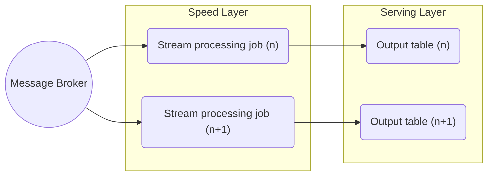

Kappa architecture is a big data processing pattern that has historically diverged from [[Lambda Architecture|Lambda]]. Its foundation is to treat all arriving data as a stream, therefore it contains no batch layer by design, relying solely on a [[Stream Data Processing|stream processing]] layer ("speed layer"). 

## Kappa Architecture Advantages

- a need to maintain, develop and debug much smaller codebase compared to Lambda architecture.
- advantageous for use cases that require high data velocity.
## Kappa Architecture Disadvantages

- general challenges related to implementing stream processing at scale.
- higher data loss risks by design - requires specific data storage and recovery strategies.
## Kappa Architecture Learning Resources

[Questioning the Lambda Architecture – O’Reilly (oreilly.com)](https://www.oreilly.com/radar/questioning-the-lambda-architecture/)

%% wiki footer: Please don't edit anything below this line %%

## This note in GitHub

[Edit In GitHub](https://github.dev/data-engineering-community/data-engineering-wiki/blob/main/Concepts/{{title}}.md "git-hub-edit-note") | [Copy this note](https://raw.githubusercontent.com/data-engineering-community/data-engineering-wiki/main/Concepts/{{title}}.md "git-hub-copy-note")

Was this page helpful?
[👍](https://tally.so/r/mOaxjk?rating=Yes&url=https://dataengineering.wiki/Concepts/{{title}}) or [👎](https://tally.so/r/mOaxjk?rating=No&url=https://dataengineering.wiki/Concepts/{{title}})
