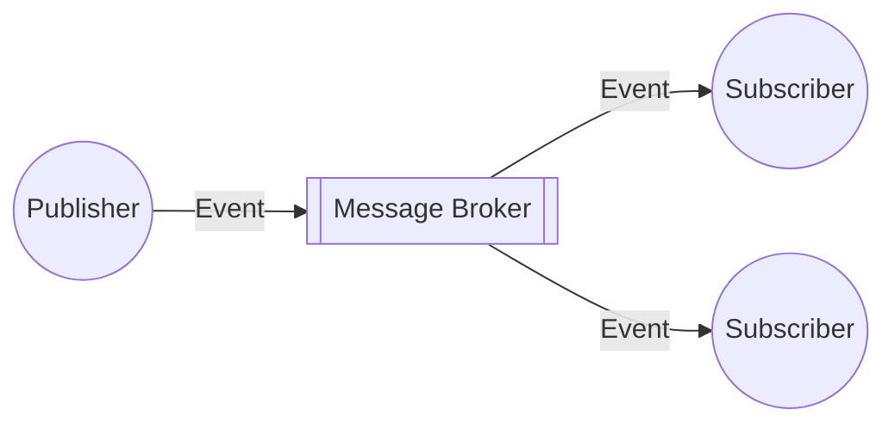

The Publisher-Subscriber pattern is an asynchronous messaging pattern that decouples sending events to one or more subscribers/consumers of those events. [^1]

## Publisher-Subscriber Pattern Advantages

- Decouples software and improves scalability due to async sending and ability to scale different parts of the system independently. [^2]
- Push-based delivery reduces latency and eliminates the need for polling.
- Simplifies integration code between systems.

## Publisher-Subscriber Pattern Disadvantages

- Message ordering isn't guaranteed and messages may be duplicated. Must design system to be [[Idempotence|idempotent]].
- Subscribers may need the ability to autoscale to keep up with the rate of messages.

## Popular Publisher-Subscriber Tools

- [[Apache Kafka]]
- [[Redis]]
- [AWS EventBridge](https://aws.amazon.com/eventbridge/)
- [Azure Event Grid](https://azure.microsoft.com/en-us/products/event-grid/)
- [GCP Eventarc](https://cloud.google.com/eventarc/)

[^1]: https://learn.microsoft.com/en-us/azure/architecture/patterns/publisher-subscriber
[^2]: https://aws.amazon.com/what-is/pub-sub-messaging/

%% wiki footer: Please don't edit anything below this line %%

## This note in GitHub

[Edit In GitHub](https://github.dev/data-engineering-community/data-engineering-wiki/blob/main/Concepts/Publisher-Subscriber%20Pattern.md "git-hub-edit-note") | [Copy this note](https://raw.githubusercontent.com/data-engineering-community/data-engineering-wiki/main/Concepts/Publisher-Subscriber%20Pattern.md "git-hub-copy-note")

Was this page helpful?
[👍](https://tally.so/r/mOaxjk?rating=Yes&url=https://dataengineering.wiki/Concepts/Publisher-Subscriber%20Pattern) or [👎](https://tally.so/r/mOaxjk?rating=No&url=https://dataengineering.wiki/Concepts/Publisher-Subscriber%20Pattern)
