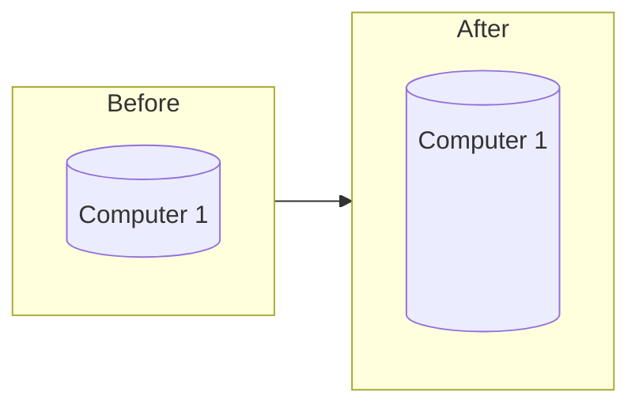

Vertical scaling is when you increase the capacity of a system by increasing the compute size.

## Vertical Scaling Advantages

- Very simple and straight forward
- No code or design changes needed

## Vertical Scaling Disadvantages

- Becomes more expensive (compared to [[Horizontal Scaling|horizontal scaling]]) as more specialized hardware is needed to achieve higher levels of performance
- Increased risk of a single point of failure

%% wiki footer: Please don't edit anything below this line %%

## This note in GitHub

[Edit In GitHub](https://github.dev/data-engineering-community/data-engineering-wiki/blob/main/Concepts/Vertical%20Scaling.md "git-hub-edit-note") | [Copy this note](https://raw.githubusercontent.com/data-engineering-community/data-engineering-wiki/main/Concepts/Vertical%20Scaling.md "git-hub-copy-note")

Was this page helpful?
[👍](https://tally.so/r/mOaxjk?rating=Yes&url=https://dataengineering.wiki/Concepts/Vertical%20Scaling) or [👎](https://tally.so/r/mOaxjk?rating=No&url=https://dataengineering.wiki/Concepts/Vertical%20Scaling)
