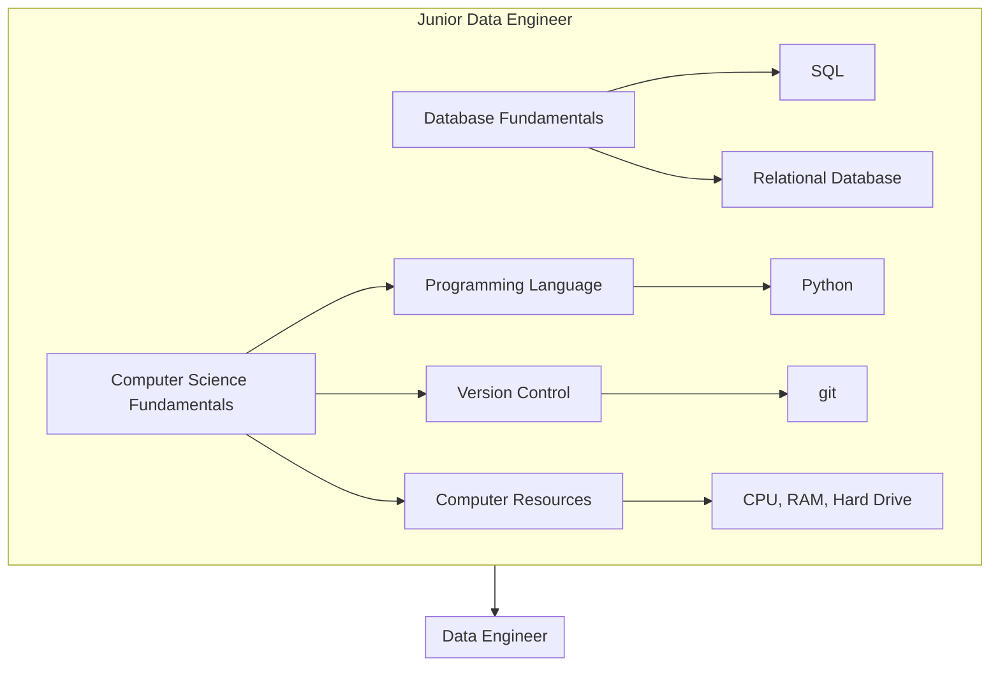

The data engineer roadmaps is a role-based roadmap that aims to consolidate the skills and requirements needed for the majority of data engineering roles. Data engineering roles may vary from company to company and depending on your location in the world. While this roadmap will give you a solid foundation of skills, you should also check job listings in your region to see which tools are in demand.

> [!Info] [[#Data Engineer Roadmap Text Version|Click here]] to see the text version of this roadmap.

## Visual Roadmap
---

## Text Roadmap

---

### Junior Data Engineer

#### Database Fundamentals

##### SQL

##### Relational Database

#### Computer Science Fundamentals

##### Programming Language

###### Python

##### Version Control

###### git

##### Computer Resources

###### CPU, RAM, Hard Drive

---

### Data Engineer

#placeholder

---

### Senior Data Engineer

#placeholder