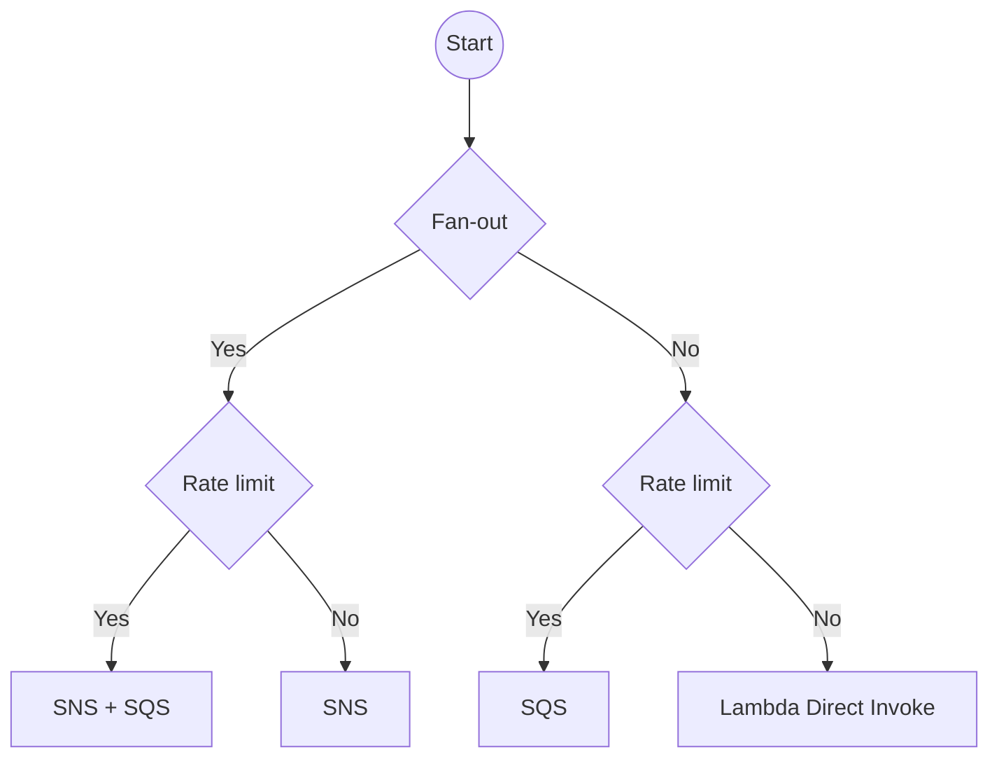

## Overview

A short guide on choosing which messaging service(s) to use.

## AWS

Source: [AWS re:Invent 2020: Scalable serverless event-driven architectures with SNS, SQS & Lambda](https://www.youtube.com/watch?v=8zysQqxgj0I&t=1887s)

## Azure

#placeholder/description 

## GCP

#placeholder/description 

%% wiki footer: Please don't edit anything below this line %%

## This note in GitHub

[Edit In GitHub](https://github.dev/data-engineering-community/data-engineering-wiki/blob/main/Guides/Choosing%20your%20optimal%20messaging%20service.md "git-hub-edit-note") | [Copy this note](https://raw.githubusercontent.com/data-engineering-community/data-engineering-wiki/main/Guides/Choosing%20your%20optimal%20messaging%20service.md "git-hub-copy-note")

Was this page helpful?
[👍](https://tally.so/r/3jZ8D4?rating=Yes&url=https://dataengineering.wiki/Guides/Choosing+your+optimal+messaging+service) or [👎](https://tally.so/r/3jZ8D4?rating=No&url=https://dataengineering.wiki/Guides/Choosing+your+optimal+messaging+service)
