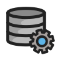

  
   
  
  

# Data Engineering Wiki

The best place to learn data engineering. Built and maintained by the [data engineering community](https://www.reddit.com/r/dataengineering).

## What's inside?

A collection of notes that are connected organically but loosely organized into the following categories:

1. **[Concepts](https://dataengineering.wiki/Concepts/Concepts):** Concepts related to Data Engineering.
2. **[FAQ](https://dataengineering.wiki/FAQ/FAQ):** Frequently asked questions about Data Engineering.
3. **[Guides](https://dataengineering.wiki/Guides/Guides):** Understand how to make Data Engineering decisions.
4. **[Tools](https://dataengineering.wiki/Tools/Tools):** Commonly used tools for Data Engineering.
5. **[Tutorials](https://dataengineering.wiki/Tutorials/Tutorials):** Step-by-step instructions for Data Engineering tasks.
6. **[Learning Resources](https://dataengineering.wiki/Learning+Resources):** Learn Data Engineering with resources recommended by the Data Engineering community.

## Sponsors

The Data Engineering Wiki is an CC0-1.0-licensed open source project with its ongoing development made possible entirely by the support of these awesome [backers](https://github.com/data-engineering-community/data-engineering-wiki/blob/main/BACKERS.md). If you'd like to join them, please consider [sponsoring the Data Engineering Wiki's development](https://github.com/data-engineering-community/data-engineering-wiki).

## Gold Sponsors

## How to run it locally

The wiki can be used offline and can be used as-is or incorporated into your own personal knowledge management system. It is built to be used with [Obsidian](https://obsidian.md/) (free, no affiliation) but is compatible with other tools as well such as [Foam](https://github.com/foambubble/foam) or [Roam Research](https://roamresearch.com/).

1. Download this GitHub repository.
2. Download the free [Obsidian desktop app](https://obsidian.md/).
3. Run the Obsidian app and choose **Open folder as vault**, click **Open**.
4. In the file browser, choose the folder where you downloaded the GitHub repository, click **Open**.

See [Obsidian help](https://help.obsidian.md/) for questions on using Obsidian.

## Contributing

There are many different ways to contribute to the wiki's development. If you're interested, check out our [contributing guidelines](https://github.com/data-engineering-community/data-engineering-wiki/blob/main/CONTRIBUTING.md) to learn how you can get involved.
